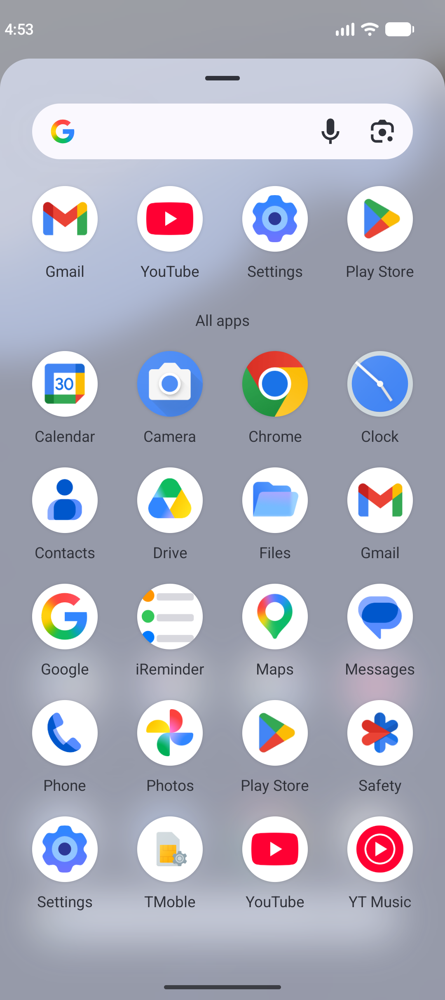
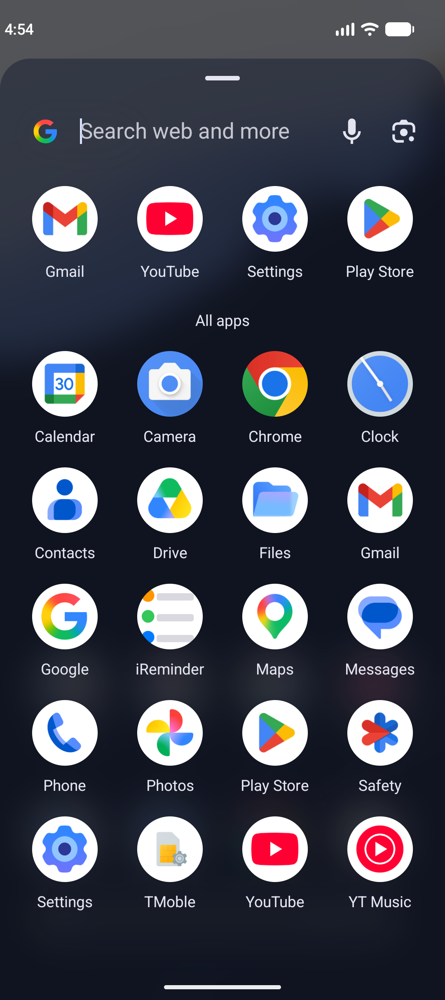
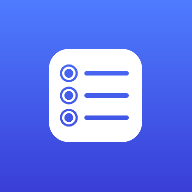

# iReminder — Apple Reminders for Android

**Use Apple Reminders on Android.** iReminder is a small, unofficial Android
app that gives you access to your Apple Reminders through Apple's official
Reminders web interface — so your existing Apple reminders are finally
available on your Android phone.

[](LICENSE)
[](https://github.com/Geet-Prince/iReminder/releases/latest)
[](https://developer.android.com/)
[](PRIVACY.md)

---

## ⚠️ Important disclaimer

> **iReminder is an independent open-source project and is not affiliated
> with, endorsed by, or sponsored by Apple Inc.**
> Apple and Apple Reminders are trademarks of Apple Inc.
> iReminder is an unofficial third-party app. Please read this before
> downloading.

iReminder does not contain any Apple code, and it is not an official Apple
product. It simply displays Apple's own Reminders web page inside a native
Android app shell.

---

## Download

### Latest Release — v1.0.0

### 👉 [Download iReminder v1.0.0 APK](https://github.com/Geet-Prince/iReminder/releases/download/v1.0.0/iReminder-v1.0.0.apk)

All versions are on the **[GitHub Releases page →](https://github.com/Geet-Prince/iReminder/releases)**

| | |
|---|---|
| **File** | `iReminder-v1.0.0.apk` |
| **Size** | ~2.5 MB |
| **Requires** | Android 7.0 (API 24) or newer |
| **Price** | Free, no ads, no in-app purchases |
| **Source** | Fully open source (MIT) |

You do not need to search the source code for the APK — it is attached
directly to the release page linked above.

---

## Installation

1. Go to the **[latest GitHub Release](https://github.com/Geet-Prince/iReminder/releases/latest)**.
2. Download **`iReminder-v1.0.0.apk`**.
3. Install the APK on your Android device. (Open the downloaded file and tap
   **Install**.)
4. Open **iReminder** from your app drawer.
5. Sign in through Apple's website when prompted.
6. Start using your Apple Reminders.

### If Android blocks the install

Android does not allow installing apps from outside the Play Store by
default, so it may ask you to allow installation from that source. If you see
a warning such as *"For your security, your phone is not allowed to install
unknown apps from this source"*:

1. Tap **Settings** on that prompt (or open **Settings → Apps → Special app
   access → Install unknown apps**).
2. Find the app you used to open the download — usually your **browser** or
   **Files** app — and allow it to install apps.
3. Go back and tap the downloaded `iReminder-v1.0.0.apk` again.

You can revoke this permission at any time in the same settings screen. It
only affects which apps that one source may install, not iReminder itself.

> **Tip:** after installing, you can turn off *"Allow from this source"* again
> to keep your device locked down.

---

## Screenshots

| Light theme | Dark theme |
|---|---|
|  |  |

iReminder follows your system theme by default, and includes a sun/moon
toggle in the bottom corner so you can switch the appearance instantly.

<p align="center">
  
</p>

---

## Features

- **Apple Reminders on Android** — access your Apple Reminders from your
  Android phone, no browser required.
- **A real app experience** — runs full-screen with no browser address bar,
  tabs, or menus. It feels like a normal Android app.
- **Sign in once** — your Apple session is stored by the app, so you are not
  asked to log in again every time you open iReminder.
- **Light and dark themes** — follows your phone's system theme, with a
  one-tap sun/moon toggle if you prefer to override it.
- **Lightweight** — around 2.5 MB, a single screen, no background services,
  no battery drain.
- **Open source** — the entire source is available under the MIT licence, so
  you can read exactly what the app does.
- **No advertisements** — no ads, no ad SDKs, no sponsored anything.
- **Privacy-focused** — no analytics, no tracking, no telemetry. See
  [PRIVACY.md](PRIVACY.md).
- **No extra account** — there is nothing to register for. You only ever sign
  in with Apple.

---

## How sign-in works

This is the part people most often want to understand, so here it is in full.

iReminder displays **Apple's Reminders web page** — the same page you would
reach by typing `icloud.com/reminders` into a phone browser — inside Android's
standard `WebView` component.

1. iReminder opens Apple's sign-in page.
2. **You type your Apple ID and password into Apple's page, not into
   iReminder.** iReminder has no login form of its own.
3. Apple verifies you (including two-factor authentication, if you have it
   enabled). That check belongs entirely to Apple.
4. Apple issues session cookies. Android's `WebView` stores them in the app's
   private storage, which is how the app stays signed in next time.

iReminder **cannot** skip, bypass, or automate Apple's authentication, and it
makes no attempt to. If Apple asks you to verify your identity, you will see
that prompt on Apple's page and must complete it there.

The stored session lasts as long as **Apple** keeps it valid. If you sign out
of iCloud elsewhere, change your password, or Apple expires the session, you
will simply be asked to sign in again.

---

## FAQ

### Can I use Apple Reminders on Android?

Yes. iReminder provides an Android interface for accessing Apple Reminders
through Apple's web service. Your reminders sync from your existing Apple
account, so nothing is re-created or migrated.

### Is there an Apple Reminders app for Android?

No — Apple does not publish a native Reminders app for Android. iReminder is
an **unofficial** third-party alternative that wraps Apple's own Reminders
web interface in a lightweight Android app.

### Is iReminder an official Apple application?

**No.** iReminder is an independent open-source project. It is not developed
by, affiliated with, endorsed by, or sponsored by Apple Inc. Apple and Apple
Reminders are trademarks of Apple Inc.

### Do I need to log in every time?

No. Once you sign in, the app keeps the session that Apple's website issued,
and it is reused when you reopen iReminder. You will only be asked to sign in
again if that session stops being valid — for example if you sign out of
iCloud on another device, change your Apple password, or Apple expires the
session for security reasons.

### Does iReminder store my Apple password?

**No.** iReminder never asks for, receives, or stores your Apple ID or
password. Sign-in happens entirely on Apple's own sign-in page, over HTTPS,
handled by Apple. iReminder is not a login form and has no code that reads or
transmits your credentials. The only local storage is the ordinary session
cookie data that the web view needs to keep you signed in.

### Does iReminder send my reminders anywhere?

No. iReminder has no servers and uploads nothing. Your reminders are loaded
straight from Apple to your device, exactly as they are in a browser.

### Do I need an iReminder account?

No. There is no sign-up. You only ever sign in with Apple.

### Are there ads or tracking?

None. iReminder contains no advertising, no analytics, and no tracking. The
only network requests it makes are to Apple's servers to load the Reminders
page. Full details are in [PRIVACY.md](PRIVACY.md).

### Is iReminder open source?

Yes — the full source code is in this repository under the
[MIT licence](LICENSE). You can read it, check what it does, and build it
yourself. Openness is the point: it is how you can verify the privacy claims
on this page.

### Where can I download iReminder?

From the **[GitHub Releases page](https://github.com/Geet-Prince/iReminder/releases)**.
The direct download link for the current version is in the
[Download section](#download) at the top of this page.

### Does it work offline?

No. iReminder is a web client, so it needs an internet connection to reach
Apple's servers. It does not cache your reminders on the device for offline
use.

### Why does it not support notifications, widgets or a home-screen shortcut?

Those features would require privileged system access that only a
cooperatively built app can have. iReminder deliberately stays a simple
web client, and adds no functionality beyond what the Apple Reminders web
interface itself provides.

---

## Requirements

| | |
|---|---|
| **Android version** | Android 7.0 (API 24) or newer |
| **Network** | Internet connection required |
| **Apple account** | Required — an active Apple account with iCloud/Reminders |
| **Cost** | Free |

---

## Version history

| Version | Date | Highlights |
|---|---|---|
| **v1.0.0** | 2026-09-30 | First public release. Apple Reminders web client for Android, persistent Apple session, light/dark themes, back-button navigation. |

Full details are in the [CHANGELOG.md](CHANGELOG.md).

---

## Build it yourself

You do not need to build anything to use iReminder — just download the APK.
But since the project is open source, you can verify it:

```bash
git clone https://github.com/Geet-Prince/iReminder.git
cd iReminder
./gradlew assembleDebug
```

Requires Android Studio or the Android SDK, and JDK 11 or newer. Built with
the Android Gradle Plugin and AndroidX AppCompat; no other runtime
dependencies.

---

## Contributing

Issues, bug reports, and pull requests are welcome. Please read
[CONTRIBUTING.md](CONTRIBUTING.md) first, and note the
[Code of Conduct](CODE_OF_CONDUCT.md).

## Security

Please report security issues responsibly — see [SECURITY.md](SECURITY.md).

## Licence

Released under the [MIT Licence](LICENSE). The source code is open and you
are free to inspect, modify, and redistribute it under those terms.

## Credits

- App icon: **Reminders** icon by [Icons8](https://icons8.com/icon/set/reminders)
  / FlatIcons, used under the [Icons8 Licence](https://icons8.com/license) and
  composited onto a custom gradient background. See
  [ATTRIBUTIONS.md](ATTRIBUTIONS.md) for full third-party credits.
- Runtime dependency: [AndroidX AppCompat](https://developer.android.com/jetpack/androidx/releases/appcompat)
  (Apache 2.0).

## Disclaimer

> iReminder is an independent open-source project and is not affiliated with,
> endorsed by, or sponsored by Apple Inc. Apple and Apple Reminders are
> trademarks of Apple Inc. iReminder is not an official Apple product.
>
> By using iReminder you agree to Apple's
> [Privacy Policy](https://www.apple.com/legal/privacy/) and the iCloud terms
> of service you accepted with Apple. The authors of iReminder are not
> responsible for any data stored or transmitted by Apple, nor for any outage
> or change to Apple's web services.

---

<div align="center">

**iReminder** — Apple Reminders for Android

Unofficial. Independent. Open source.

[⬇ Download the APK](https://github.com/Geet-Prince/iReminder/releases/latest) ·
[🐛 Report an issue](https://github.com/Geet-Prince/iReminder/issues) ·
[🔒 Privacy Policy](PRIVACY.md)

</div>
